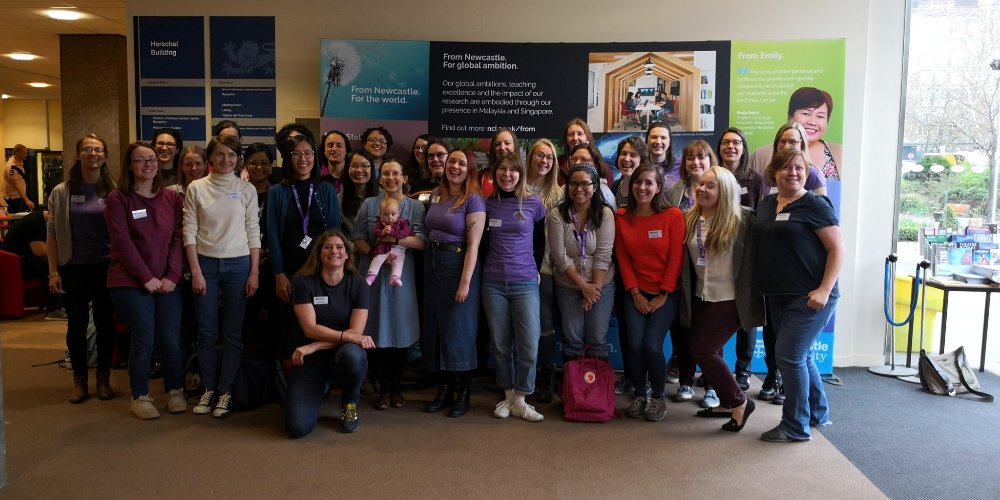
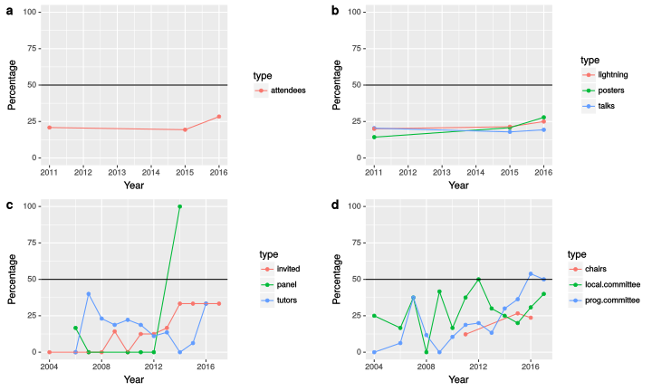

layout: true

<div class = "rladies-header">
<span class="social"><table><tr><td></td><td> @RLadiesLancs</td></tr></table></span>
</div>

```{r setup, echo  = FALSE}
library("emo")
```
---

# What is R-Ladies?

* GLobal organisation with many local chapters.
* Promoting gender diversity in the R community.
* Encouraging, inspiring, and empowering people of minority genders.
* Building a collaborative global network of R leaders, mentors, learners, and developers .



---
background-image: url("https://media.giphy.com/media/SO4trEzzGYDhC/giphy.gif")
background-position: 50% 50%
background-size: contain
class: center, bottom, inverse

---
# Why does it exist?
--


---
background-image: url("images/shiny-ladies.png")
background-position: 50% 50%
background-size: contain
class: center, bottom, inverse

[https://gqueiroz.shinyapps.io/rshinylady/](https://gqueiroz.shinyapps.io/rshinylady/)

---
# Our plan

* A mix of talks, tutorials and data evenings.
* 1st Wednesday of the month.
* On campus, for now...

---

# Get involved! `r emo::ji("purple_heart")`

* Come to meet ups.
* Join the [meet up group](https://www.meetup.com/rladies-lancaster/).
* Tell people about it.
* Tweet about it. 
* Offer to give a talk.
* Tell us what you want meet ups to be like.
* Join the online [R-Ladies community](https://rladies-community-slack.herokuapp.com/).


---

# Tonight

* 18:30 - 18:50 - Nic Crane: Ten Steps to Becoming a Tidyverse Contributor.
* 18:50 - 19:20 -`r emo::ji("pizza")`
* 19:20 - 19:40 - Rhian Davies: A day in the life with R. A whirlwind tour.
* 19:40 - 20:00 - Lucy Morgan: The rocky road to building my first R package.
* 20:00 - 20:30 - Networking/close.

## Slides: [github.com/rladies/](https://github.com/rladies/)

---
background-image: url("images/H2O_Sponsor_Slide.png")
background-position: 50% 50%
background-size: contain
class: center, bottom, inverse
