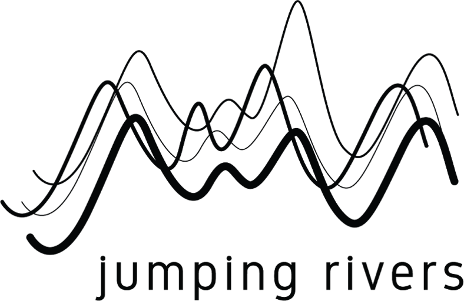

layout: true

<div class = "rladies-header">
<span class="social"><table><tr><td></td><td> @RLadiesLancs</td></tr></table></span>
</div>

```{r setup, echo = FALSE, warning = F}
#library("emo")
library(ggplot2)
```

---

# Tonight

* 18:00 - 18:50 - Novice Plotting
* 18:50 - 19:15 - Nibbles and networking
* 19:15 - 20:00 - Intermediate Plotting


### Slides: [github.com/rladies](https://github.com/rladies/)

### Book chapter: [r4ds.had.co.nz](https://r4ds.had.co.nz/data-visualisation.html)

### Slack: [bit.ly/R4DSslack](https://bit.ly/R4DSslack )


```{r, out.width = "250px", fig.align='center', echo = FALSE}

knitr::opts_chunk$set(fig.width=12, fig.height=4) 
```

---
# Tidyverse

To access the datasets, help pages, and functions that we will use tonight, load the tidyverse by running this code:

```{r install tidyverse, eval = FALSE}
install.packages("tidyverse")
```

```{r load libraries, message=FALSE, warning=FALSE}
library("tidyverse")
```

Let's also install this package
```{r intall gridExtra, message=FALSE, warning=FALSE, eval = F}
install.packages("gridExtra")
```

```{r load gridExtra, message=FALSE, warning=FALSE, eval = T}
library("gridExtra")
```

---

# The Data

* Observations collected by the US Environmental Protection Agency on 38 models of car.

```{r load ggplot2}
library("ggplot2")
```

Typing `ggplot2::mpg` will print out the data in our console.
```{r mpg print, eval = FALSE}
ggplot2::mpg
```

Using a question mark opens the help page.
```{r mpg info, eval = FALSE}
?mpg
```

Using the `View()` function opens the data in a new tab.
```{r mpg view, eval = FALSE}
View(mpg)
```

---

# Creating a ggplot

Question: Do cars with big engines use more fuel than cars with small engines? 

To plot `mpg`, run this code to put `displ` on the x-axis and `hwy` on the y-axis:

```{r mpg plot, echo=TRUE}
ggplot(data = mpg) + 
  geom_point(mapping = aes(x = displ, y = hwy))
```

---

# Creating a ggplot
`ggplot2` works in layers:

* `ggplot()` - creates a coordinate system that you can add layers to

The first argument of ggplot() is the dataset to use in the graph. 

* `geom_point()` - adds a layer of points to your plot, which creates a scatterplot. 

`ggplot2` comes with many `geom` functions that each add a different type of layer to a plot. 

Each geom function in ggplot2 takes a mapping argument. The mapping argument is always paired with `aes()`, and the `x` and `y` arguments of `aes()` specify which variables to map to the x and y axes.

`ggplot(data = <DATA>) + <GEOM_FUNCTION>(mapping = aes(<MAPPINGS>))`

---

# Excercises

1. Run `ggplot(data = mpg)`. What do you see?

2. How many rows are in `mpg`? How many columns?

3. What does the `drv` variable describe? Read the help for `?mpg` to find out.

4. Make a scatterplot of `hwy` vs `cyl`.

5. What happens if you make a scatterplot of `class` vs `drv`? Why is the plot not useful?

---

# Aesthetic Mappings

In the plot below, one group of points (highlighted in red) seems to fall outside of the linear trend. These cars have a higher mileage than you might expect. How can you explain these cars?

```{r asth, echo=FALSE, out.width = "750px", message=FALSE, warning=FALSE, paged.print=FALSE}
mpg$hybrid <- mpg$class == '2seater'
ggplot(data = mpg) + 
  geom_point(mapping = aes(x = displ, y = hwy, color = hybrid))
```

Let’s hypothesize that the cars are hybrids. One way to test this hypothesis is to look at the `class` value for each car.

---
# Aesthetic Mappings

You can add a third variable, like `class`, to a two dimensional scatterplot by mapping it to an aesthetic:

* `size`
* `shape`
* `color`
* `alpha`

```{r color class, echo=TRUE, message=FALSE, warning=FALSE, paged.print=FALSE, out.width = "750px"}
ggplot(data = mpg) + 
  geom_point(mapping = aes(x = displ, y = hwy, color = class))

```

The colors reveal that many of the unusual points are two-seater cars. 

---

# Aesthetic Mappings

In the previous example, we mapped class to the color aesthetic, but we could have mapped class to the size aesthetic in the same way. 

```{r size mapping,  out.width = "750px",echo=TRUE, warning=TRUE}
ggplot(data = mpg) + 
  geom_point(mapping = aes(x = displ, y = hwy, size = class))
```

---
# Aesthetic Mappings

You can also set manual aesthetics.

```{r blue, eval=FALSE}
ggplot(data = mpg) + 
  geom_point(mapping = aes(x = displ, y = hwy), color = "blue")
```

You’ll need to pick a level that makes sense for that aesthetic:

* The name of a color as a character string.
* The size of a point in mm.
* The shape of a point as a number, as shown in the below Figure.


```{r, out.width = "750px", fig.align='center', echo = FALSE}

```

---

# Excercises

1) What’s gone wrong with this code? Why are the points not blue?
```{r error, eval=FALSE}
ggplot(data = mpg) + 
  geom_point(mapping = aes(x = displ, y = hwy, color = "blue"))
```

2) Which variables in `mpg` are categorical? Which variables are continuous? (Hint: type `?mpg` to read the documentation for the dataset). How can you see this information when you run `mpg`?

3) Map a continuous variable to color, size, and shape. How do these aesthetics behave differently for categorical vs. continuous variables?

4) What happens if you map the same variable to multiple aesthetics?

5) What does the stroke aesthetic do? What shapes does it work with? (Hint: use `?geom_point`)

6) What happens if you map an aesthetic to something other than a variable name, like `aes(colour = displ < 5)`? Note, you’ll also need to specify `x` and `y`.

---
# Facets

It may be useful to split your plot into *facets*, subplots that each display one subset of the data.

```{r facets, out.width = "750px"}
ggplot(data = mpg) + 
  geom_point(mapping = aes(x = displ, y = hwy)) + 
  facet_wrap(~ class, nrow = 2)
```

The first argument of `facet_wrap()` should be a formula. The variable that you pass to `facet_wrap()` should be discrete.

---

# Facets

To facet your plot on the combination of two variables, add `facet_grid()` to your plot call. 

```{r facets2}
ggplot(data = mpg) + 
  geom_point(mapping = aes(x = displ, y = hwy)) + 
    facet_grid(drv ~ cyl)
```

The first argument of `facet_grid()` is also a formula. This time the formula should contain two variable names separated by a `~`.

---
# Facets

If you prefer to not facet in the rows or columns dimension, use a `.` instead of a variable name, e.g. `+ facet_grid(. ~ cyl)`.

```{r facets3}
ggplot(data = mpg) + 
  geom_point(mapping = aes(x = displ, y = hwy)) + 
    facet_grid(. ~ cyl)
```

---

# Exercises

1) What happens if you facet on a continuous variable?

2) What do the empty cells in plot with `facet_grid(drv ~ cyl)` mean? How do they relate to this plot?
```{r ex2, eval=FALSE}
    ggplot(data = mpg) + 
      geom_point(mapping = aes(x = drv, y = cyl))
```

3) What plots does the following code make? What does `.` do?

```{r ex3, eval = F}    
    ggplot(data = mpg) + 
      geom_point(mapping = aes(x = displ, y = hwy)) +
      facet_grid(drv ~ .)
    
    ggplot(data = mpg) + 
      geom_point(mapping = aes(x = displ, y = hwy)) +
      facet_grid(. ~ cyl)
```

---

# Exercises Continuted

4) Take the first faceted plot in this section:

```{r ex4, eval = F, message = F}
    ggplot(data = mpg) + 
      geom_point(mapping = aes(x = displ, y = hwy)) + 
      facet_wrap(~ class, nrow = 2)
```

What are the advantages to using faceting instead of the colour aesthetic? What are the disadvantages? How might the balance change if you had a larger dataset?

5) Read `?facet_wrap`. What does `nrow` do? What does `ncol` do? What other options control the layout of the individual panels? Why doesn’t `facet_grid()` have nrow and ncol arguments?

6) When using `facet_grid()` you should usually put the variable with more unique levels in the columns. Why?

---

# Geometric Objects

A *geom* is the geometrical object that a plot uses to represent data. For example, bar charts use bar geoms, line charts use line geoms, boxplots use boxplot geoms. Scatterplots use the point geom. 

```{r geoms, warning = F, message = F}
p1 <- ggplot(data = mpg) + 
  geom_point(mapping = aes(x = displ, y = hwy))

p2 <- ggplot(data = mpg) + 
  geom_smooth(mapping = aes(x = displ, y = hwy)) 

grid.arrange(p1, p2, ncol = 2)
```

---

# Geometric Objects

Every geom function in `ggplot2` takes a mapping argument. But be careful, not every aesthetic works with every geom! You could set the shape of a point, but you couldn’t set the “shape” of a line. 

---

# Geometric Objects

Here `geom_smooth() `separates the cars into three lines based on their `drv` value. 

```{r geom_smooth, warning = F, message = F}
ggplot(data = mpg) + 
  geom_smooth(mapping = aes(x = displ, y = hwy, linetype = drv))
```

---

# Geometric Objects

We can make this clearer by overlaying the lines on top of the raw data and then coloring everything according to `drv`.

```{r geom_smooth2, message=FALSE, warning=F}
ggplot(data = mpg) + 
  geom_point(mapping = aes(x = displ, y = hwy, color = drv)) +
  geom_smooth(mapping = aes(x = displ, y = hwy, color = drv))
```

To display multiple geoms in the same plot, we simply add multiple geom functions to `ggplot()`.

---
# Exercises 

1) What geom would you use to draw a line chart? A boxplot? A histogram? An area chart?

2) Run this code in your head and predict what the output will look like. Then, run the code in R and check your predictions.

```{r ex, warning=F, eval = F}
    ggplot(data = mpg, mapping = aes(x = displ, y = hwy, color = drv)) + 
      geom_point() + 
      geom_smooth(se = FALSE)
```

What does `show.legend = FALSE` do? What happens if you remove it? What does the `se` argument to `geom_smooth()` do?

3) Will these two graphs look different? Why/why not?

```{r v1, eval = F}
    ggplot(data = mpg, mapping = aes(x = displ, y = hwy)) +      
      geom_point() + 
      geom_smooth()
```
```{r v2, eval = F}
    ggplot() + 
      geom_point(data = mpg, mapping = aes(x = displ, y = hwy)) + 
      geom_smooth(data = mpg, mapping = aes(x = displ, y = hwy))
```

---

# Bar Charts

A basic bar chart, as drawn with `geom_bar()`:

```{r mutate referal}
ggplot(data = diamonds) + 
  geom_bar(mapping = aes(x = cut)) +
  theme(axis.text.x = element_text(angle = 90, hjust = 1))
```

---
# Bar Charts 

It is sometimes important to plot bar charts in (decreasing) size order:

```{r barstat}
diamonds$cut <- factor(diamonds$cut,
                       levels = names(sort(table(diamonds$cut),
                       decreasing = TRUE)))

ggplot(data = diamonds) + 
  stat_count(mapping = aes(x = cut)) +
  theme(axis.text.x = element_text(angle = 90, hjust = 1))
```


---

# Bar Charts

You can colour a bar chart using either the `colour` aesthetic, or, more usefully, `fill`:

```{r bar charts colours0}
# Left
p1 <- ggplot(data = diamonds) + 
  geom_bar(mapping = aes(x = cut, colour = cut)) +
    theme(axis.text.x = element_text(angle = 90, hjust = 1))
  

# Right
p2 <- ggplot(data = diamonds) + 
  geom_bar(mapping = aes(x = cut, fill = cut)) +
    theme(axis.text.x = element_text(angle = 90, hjust = 1)) 

grid.arrange(p1, p2, ncol = 2)
```

---

# Bar Charts

You can even map the `fill` aesthetic to another variable. The bars are automatically stacked. Each colored rectangle represents a combination of cut and clarity.

```{r bar charts colours}

ggplot(data = diamonds) + 
  geom_bar(mapping = aes(x = cut, fill = clarity))+
    theme(axis.text.x = element_text(angle = 90, hjust = 1))

```
---

# Bar Charts

`position = "fill"` works like stacking, but makes each set of stacked bars the same height. This makes it easier to compare proportions across groups.


```{r summarise}

ggplot(data = diamonds) + 
  geom_bar(mapping = aes(x = cut, fill = clarity), position = "fill") +
    theme(axis.text.x = element_text(angle = 90, hjust = 1))
```


---
# Bar Charts

`position = "dodge"` places overlapping objects directly beside one another. This makes it easier to compare individual values.

```{r summarise grouped}
ggplot(data = diamonds) + 
  geom_bar(mapping = aes(x = cut, fill = clarity), position = "dodge")+
  theme(axis.text.x = element_text(angle = 90, hjust = 1))
```


---

# Coordinate Systems

There are a number of coordinate systems that are occasionally helpful.

`coord_flip()` switches the x and y axes.

```{r boxplot, eval = TRUE}
p1 <- ggplot(data = mpg, mapping = aes(x = class, y = hwy)) + 
  geom_boxplot() 

p2 <- ggplot(data = mpg, mapping = aes(x = class, y = hwy)) + 
  geom_boxplot() +
  coord_flip()

grid.arrange(p1, p2, ncol = 2)
```

---

# Coordinate Systems

`coord_polar()` uses polar coordinates.

```{r pipe2, echo=TRUE}
bar <- ggplot(data = diamonds) + 
  geom_bar(
    mapping = aes(x = cut, fill = clarity), 
    show.legend = FALSE,
    width = 1
  ) + 
  theme(aspect.ratio = 1) +
  labs(x = NULL, y = NULL)

p1 <- bar + coord_flip()
p2 <- bar + coord_polar()
```

```{r plotcoord, echo=FALSE}
grid.arrange(p1, p2, ncol = 2)
```

---

# Summary
We can use the following template to produce plots using `ggplot2`.

```{r template, eval=FALSE}
ggplot(data = <DATA>) + 
  <GEOM_FUNCTION>(
     mapping = aes(<MAPPINGS>),
     stat = <STAT>, 
     position = <POSITION>
  ) +
  <COORDINATE_FUNCTION> +
  <FACET_FUNCTION>
```

---