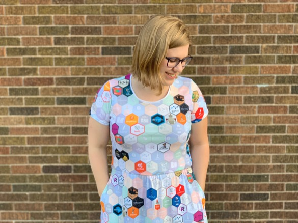

layout: true

<div class = "rladies-header">
<span class="social"><table><tr><td></td><td> @RLadiesLancs</td></tr></table></span>
</div>

```{r setup, echo=FALSE}
knitr::opts_chunk$set(echo = TRUE, warning = FALSE)
```

---


# RStudio Conference 2020

* In San Francisco
* ~2400 attendees
* Broad disciplines
* 2 days workshops (materials online)
* 2 days talks (videos online soon)
* Lots of R-Ladies!


```{r, out.width = "500px", echo = FALSE, fig.align="center"}

```


---

# Workshops

* All material [available online](https://github.com/rstudio-conf-2020)


* A Practical Introduction to Data Visualization with ggplot2 Workshop
* Applied Machine Learning Workshop
* Big Data with R Workshop
* Building Tidy Tools Workshop
* Deep Learning with Keras and TensorFlow in R Workshop
* Designing the Data Science Classroom Workshop
* Introduction to Data Science in the Tidyverse Workshop
* Introduction to Machine Learning with the Tidyverse Workshop
* JavaScript for Shiny Users Workshop
* Modern Geospatial Data Analysis with R Workshop
* My Organization's First R Package Workshop
* R for Excel Users Workshop
* R Markdown and Interactive Dashboards Workshop
* RStudio Instructor Training Workshop (1-day)
* RStudio Professional Products Administration Workshop
* Shiny From Start To Finish Workshop
* Text Mining with Tidy Data Principles Workshop
* Tidy Time Series and Forecasting in R Workshop
* What They Forgot to Teach You about R Workshop

---

# Tidy Time Series

.pull-left[
* Rob Hyndman 
* Manipulating time series data
* Forecasting
* All in the tidyverse framework
* Free book [FPP3](https://otexts.com/fpp3/)

## R packages

* tsibble
* feasts
* fable

]
.pull-right[

]

---

# What the flip is a tsibble?

* A tsibble allows storage and manipulation of
multiple time series in R.
* It contains:
    * An index: time information about the observation
    * Measured variable(s): numbers of interest
    * Key variable(s): optional unique identifiers for each
series
* It works with tidyverse functions.

```{r, out.width = "300px", echo = FALSE, fig.align="center"}
knitr::include_graphics("images/tsibble.png")
```

---

# Example

```{r, echo = FALSE, message = FALSE, warning = FALSE}
library("fpp3")
library("tidyverse")
tourism %>%
  slice(1:20) %>%
  DT::datatable()
```
---

# Quarterly Australian Beer Production

```{r, out.height="400px"}
beer <- aus_production %>%
select(Quarter, Beer) %>%
filter(year(Quarter) >= 1992)
beer %>% autoplot(Beer)
```

---

# Quarterly Australian Beer Production

```{r, out.height="400px"}
beer %>% gg_season(Beer, labels = "right")
```

---

# Multiple seasonal periods

```{r, out.height="400px"}
vic_elec %>% gg_season(Demand)
```

---

# Multiple seasonal periods

```{r, out.height="400px"}
vic_elec %>% gg_season(Demand, period = "week")
```

---

# Multiple seasonal periods

```{r, out.height="400px"}
vic_elec %>% gg_season(Demand, period = "day")
```
---

# Quarterly Australian Beer Production

```{r, out.height="400px"}
beer %>% gg_subseries(Beer)
```

---

# Australian holidays

```{r, out.height="400px"}
holidays <- tourism %>%
filter(Purpose == "Holiday") %>%
group_by(State) %>%
summarise(Trips = sum(Trips))

holidays %>% autoplot(Trips) +
ylab("thousands of trips") + xlab("Year") +
ggtitle("Australian domestic holiday nights")
```
---

# Seasonal Plots

```{r, out.height="400px"}
holidays %>% gg_season(Trips) +
ylab("thousands of trips") +
ggtitle("Australian domestic holiday nights")
```

---
# Seasonal subseries plots

```{r, out.height="400px"}
holidays %>%
gg_subseries(Trips) + ylab("thousands of trips") +
ggtitle("Australian domestic holiday nights")
```

---

# Calendar Plots

```{r, echo = FALSE, out.height="400px", message = FALSE}
library(sugrrants)
vic_elec %>%
filter(year(Date) == 2014) %>%
mutate(Hour = hour(Time)) %>%
frame_calendar(
x = Hour, y = Demand, date = Date,
nrow = 4
) %>%
ggplot(aes(x = .Hour, y = .Demand, group = Date)) +
geom_line() -> p1
prettify(p1,
size = 3,
label.padding = unit(0.15, "lines")
)
```

---

# RStudio becomes a PBC

* Mission: Open source software for statistical computing
* Started developing in 2008
* Corporations are by-default not trustworthy 
* Community needs to trust that our mission open-source software

--

## So far...

* 250 open source projects
* 36 full-time engineers dedicated to open source software (54%)
* Hundreds of millions of downloads of open source products/packages


```{r, out.width = "500px", echo = FALSE, fig.align="center"}
knitr::include_graphics("images/RStudio-Logo-Flat.png")
```


---

# Styling Shiny apps with Sass and Bootstrap

* Joe Cheng
* Shiny apps can look a bit samey
* Use SASS to style
* Fancy interactive helper function


```{r, out.width = "500px", echo = FALSE, fig.align="center"}

```

---

# Glamour of Graphics: Will Chase

```{r, out.width = "300px", echo = FALSE, fig.align="center"}

```


---

# Glamour of Graphics: skip the labels

<blockquote class="twitter-tweet"><p lang="en" dir="ltr">I so agree with this statement from <a href="https://twitter.com/W_R_Chase?ref_src=twsrc%5Etfw">@W_R_Chase</a>: you remove the need for axis labels with good titles. Applies to simpler plots, but I think label all axes all the time is too strict an advice. <a href="https://twitter.com/hashtag/rstudioconf?src=hash&amp;ref_src=twsrc%5Etfw">#rstudioconf</a> <a href="https://t.co/3LkJlLn00W">pic.twitter.com/3LkJlLn00W</a></p>&mdash; Mine CetinkayaRundel (@minebocek) <a href="https://twitter.com/minebocek/status/1222952045327446016?ref_src=twsrc%5Etfw">January 30, 2020</a></blockquote> <script async src="https://platform.twitter.com/widgets.js" charset="utf-8"></script>

---

# Glamour of Graphics: skip the legend


<blockquote class="twitter-tweet"><p lang="en" dir="ltr">Awesome tip from <a href="https://twitter.com/W_R_Chase?ref_src=twsrc%5Etfw">@W_R_Chase</a> on legends - see if you can skip them entirely by using color in your title <a href="https://twitter.com/hashtag/rstudioconf?src=hash&amp;ref_src=twsrc%5Etfw">#rstudioconf</a> <a href="https://t.co/qg5OG1dPKt">pic.twitter.com/qg5OG1dPKt</a></p>&mdash; Emily Robinson (@robinson_es) <a href="https://twitter.com/robinson_es/status/1222953128313544705?ref_src=twsrc%5Etfw">January 30, 2020</a></blockquote> <script async src="https://platform.twitter.com/widgets.js" charset="utf-8"></script>

---
# Teacup giraffes

* Gentle introduction to statistics with R
* Nice story telling
* Really cute graphics
* [Website](https://tinystats.github.io/teacups-giraffes-and-statistics/01_introToR.html)


```{r, out.width = "600px", echo = FALSE, fig.align="center"}

```

---
# Don’t Repeat Yourself, Talk To Yourself! 

* Repeated Reporting In The R Universe
* [Sharla Gelfand](https://twitter.com/sharlagelfand)
* [Slides](https://sharstudioconf.netlify.com/#1)
* Write "chatty functions" using the **usethis** package

```{r}
library("usethis")
analysis_year <- 2019
ui_info("Hi")
ui_todo("Querying demographics data for {analysis_year}...")
ui_done("Analysis complete")
```

---

# Object of type closure is not subsettable


* [Jenny Bryan](https://twitter.com/jennybryan?lang=en)
* [Slides](https://speakerdeck.com/jennybc/object-of-type-closure-is-not-subsettable)

* Reset
* Reprex
* Debug
* Deter
```{r, out.width="100px", echo = FALSE, fig.align="center"}

```


---

# Sewing a tidy dress

```{r, out.width = "500px", echo = FALSE, fig.align="center"}

```

* [GitHub](https://github.com/ameliamn/hexfabric)
* [Blog Post](https://www.amelia.mn/blog/misc/2019/08/17/Tidy-Dress.html)


---

# Live podcast


* [Live episode](http://nssdeviations.com/100-live-from-rstudio-conf-2020)

```{r, out.width = "600px", echo = FALSE, fig.align="center"}

```


